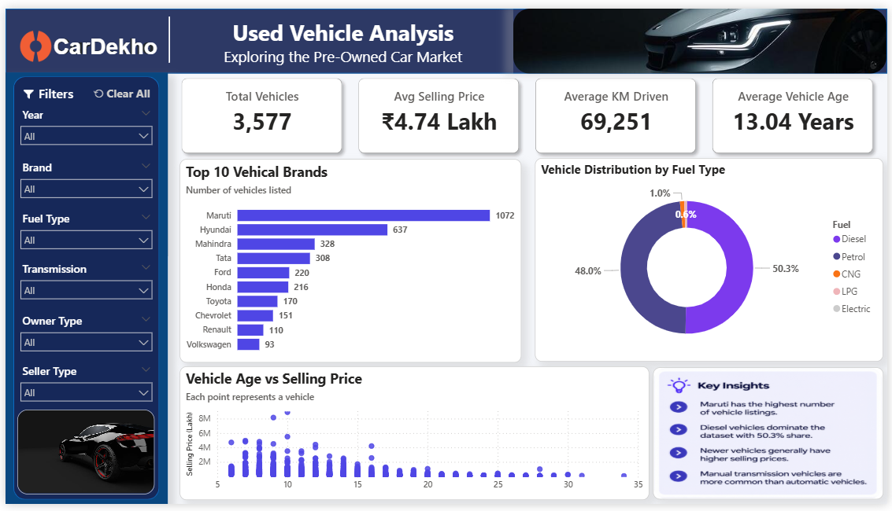

# 🚗 CarDekho-Vehicle-Sales-Analysis
Data Analytics project using Python, SQL and Power BI to analyze used vehicle sales data.

## 📊 CarDekho Used Vehicle Data Analysis using Python, SQL & Power BI

---

## 📌 Recommended Structure and Order

1. Project Overview
2. Tech Stack
3. Data Source
4. Data Cleaning & Transformation
5. Key Features / Highlights
6. SQL Analysis
7. Power BI Dashboard
8. Key Insights
9. Dashboard Preview
10. Conclusion

---

## 1. Project Overview

This project presents an end-to-end analysis of used vehicle data from CarDekho, focusing on vehicle pricing, brand popularity, fuel preferences, transmission types, ownership patterns, and vehicle usage.

The objective is to transform raw vehicle data into meaningful business insights using **Python, SQL, and Power BI**.

The project includes data cleaning and feature engineering using Python, analytical SQL queries for business insights, and an interactive Power BI dashboard for data visualization and storytelling.

---

## 2. Tech Stack

- **Python:** Data cleaning, transformation, and exploratory data analysis
- **Pandas & NumPy:** Data manipulation and analysis
- **MySQL / SQL:** Data querying and analytical analysis
- **Power BI:** Interactive dashboard development and data visualization
- **MS Excel / CSV:** Dataset storage and validation
- **Jupyter Notebook:** Python-based analysis

---

## 3. Data Source

The dataset contains used vehicle records with information about vehicle details, pricing, usage, fuel type, seller type, transmission, and ownership.

### Key Attributes

- **Vehicle Details:** Vehicle Name, Brand, Manufacturing Year
- **Pricing:** Selling Price
- **Usage:** Kilometers Driven
- **Fuel:** Diesel, Petrol, CNG, LPG, Electric
- **Seller Type:** Individual, Dealer, Trustmark Dealer
- **Transmission:** Manual, Automatic
- **Ownership:** First Owner, Second Owner, etc.

### Dataset Size

- **Original Records:** 4,340
- **Original Columns:** 8
- **Cleaned Records:** 3,577

---

## 4. Data Cleaning & Transformation

Python and Pandas were used to prepare the dataset for analysis.

### Major Data Preparation Steps

- Checked the dataset structure and data types
- Checked for missing values
- Identified and removed duplicate records
- Extracted **Brand** from the vehicle name
- Created **Vehicle Age** from the manufacturing year
- Converted selling price into **Lakh** for easier analysis
- Validated the cleaned dataset before importing it into Power BI

### Feature Engineering

**Vehicle Age:**

```text
Vehicle Age = 2026 - Manufacturing Year
```
**Selling Price in Lakh:**


```text
Selling Price (Lakh) = Selling Price / 100000
```

## 5. Key Features / Highlights

- Performed data cleaning and preprocessing using Python
- Conducted exploratory data analysis to identify important patterns
- Used SQL queries to analyze vehicle pricing, brands, fuel types, transmission, and ownership
- Developed an interactive Power BI dashboard
- Created KPI cards for key business metrics
- Analyzed the top vehicle brands by number of listings
- Analyzed vehicle distribution by fuel type
- Studied the relationship between vehicle age and selling price
- Added interactive slicers for Year, Brand, Fuel Type, Transmission, Owner, and Seller Type
- Designed a user-friendly dashboard for data-driven decision making

## 6. SQL Analysis

SQL was used to perform analytical queries on the cleaned vehicle dataset.

### Example SQL Queries

```sql
-- Total number of vehicles
SELECT COUNT(*) AS total_vehicles
FROM vehicle_cleaned;

```
```
-- Top 10 vehicle brands
SELECT brand, COUNT(*) AS vehicle_count
FROM vehicle_cleaned
GROUP BY brand
ORDER BY vehicle_count DESC
LIMIT 10;
```

```
-- Vehicle distribution by fuel type
SELECT fuel,COUNT(*) AS vehicle_count
FROM vehicle_cleaned
GROUP BY fuel
ORDER BY vehicle_count DESC;
```

```
-- Average selling price by fuel type
SELECT fuel,ROUND(AVG(selling_price_lakh), 2) AS average_price_lakh
FROM vehicle_cleaned
GROUP BY fuel
ORDER BY average_price_lakh DESC;
```
```
-- Average selling price by transmission
SELECT transmission,ROUND(AVG(selling_price_lakh), 2) AS average_price_lakh
FROM vehicle_cleaned
GROUP BY transmission
ORDER BY average_price_lakh DESC;
```

## 7. Power BI Dashboard

An interactive Power BI dashboard was developed to provide a clear overview of the used vehicle market.

### Key Performance Indicators (KPIs)

| KPI | Value |
|---|---:|
| Total Vehicles | **3,577** |
| Average Selling Price | **₹4.74 Lakh** |
| Average KM Driven | **69,251** |
| Average Vehicle Age | **13.04 Years** |

### Dashboard Components

- **Top 10 Vehicle Brands by Listings**
- **Vehicle Distribution by Fuel Type**
- **Vehicle Age vs Selling Price**
- **Key Insights Panel**
- **Year Slicer**
- **Brand Slicer**
- **Fuel Type Slicer**
- **Transmission Slicer**
- **Owner Slicer**
- **Seller Type Slicer**
- **Clear All Filters**

---

## 8. Key Insights

- **Maruti** has the highest number of vehicle listings in the dataset.
- **Diesel vehicles dominate the dataset with 50.3% share.**
- **Manual transmission vehicles** are more common than automatic vehicles.
- **Newer vehicles generally have higher selling prices.**
- The dashboard provides an interactive way to analyze vehicle characteristics and pricing patterns across different filters.

---

## 9. Power BI Dashboard Preview

### Dashboard



The dashboard provides an interactive view of vehicle listings, pricing, fuel distribution, vehicle age, and other important vehicle attributes.

---

## 10. Project Structure

```text
CarDekho-Vehicle-Sales-Analysis/
│
├── Dataset/
│   └── vehicle_cleaned.csv
│
├── Python/
│   └── CarDekho_Analysis.ipynb
│
├── SQL/
│   └── CarDekho_Analysis.sql
│
├── PowerBI/
│   └── CarDekho_Dashboard.pbix
│
├── Screenshots/
│   └── Dashboard.png
│
└── README.md
```

## Conclusion

This project demonstrates a complete **data analytics lifecycle**, including data cleaning, feature engineering, exploratory data analysis, SQL-based analysis, and interactive visualization using Power BI.

The analysis provides useful insights into **vehicle pricing, brand popularity, fuel preferences, transmission types, vehicle age, and usage patterns**.

The project demonstrates practical skills in **Python, SQL, Power BI, data cleaning, data visualization, and business intelligence**, making it suitable for a Data Analyst portfolio.
